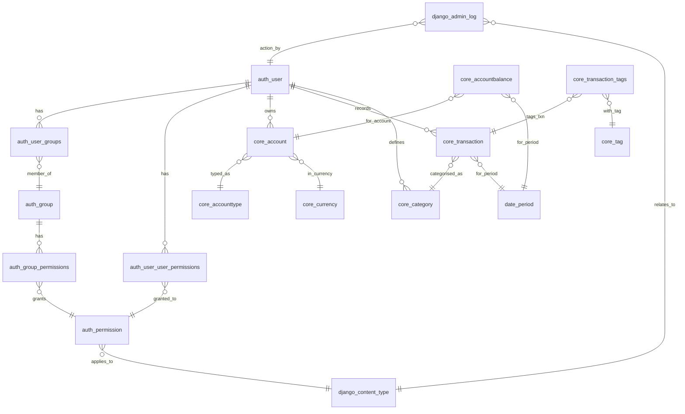

# ourfinancetracker

> **Personal finance management web application**

This repository contains the source code for **ourfinancetracker**, a Django application that allows users to record monthly balances, income, and expenses, giving them a consolidated view of their financial health without relying on external banking APIs.

## ✨ Key features

- Monthly dashboard with income, estimated expenses, and balances
- Unlimited bank and investment accounts
- Customisable categories per user
- Reusable tags to categorise transactions
- Automatic expense estimates based on balance
- Multi-currency with support for different account types
- Reports based on monthly periods
- Responsive interface with dynamic forms

## 🏗️ Tech stack

| Layer         | Technology                                |
| ------------- | ----------------------------------------- |
| Backend       | Django 5.2.1 · Python 3.12                |
| Database      | PostgreSQL (via Supabase)                 |
| Frontend      | Django Templates (initial phase)          |
| Deployment    | Render.com (configured via `render.yaml`) |
| Dev Tools     | pip · pre-commit · GitHub Actions         |

## 📐 Data model

### ER diagram



## 🚀 Getting started

```bash
# Clone the repository
git clone https://github.com/nunonuno7/ourfinancetracker.git
cd ourfinancetracker

# Install dependencies
pip install -r requirements.txt

# Copy and configure environment variables
cp .env.example .env
# edit values as needed

# Create the database and apply migrations
python manage.py migrate

# Start the local server
python manage.py runserver
```

## 🌐 Additional domains

To authorise new domains in `ALLOWED_HOSTS` or the list of CSRF trusted origins, set additional environment variables:

```bash
EXTRA_ALLOWED_HOSTS=example.com,sub.domain.com
EXTRA_CSRF_TRUSTED_ORIGINS=https://example.com,https://sub.domain.com
```

Use comma-separated values. For `EXTRA_CSRF_TRUSTED_ORIGINS`, each origin must include the scheme (`http://` or `https://`).

## 📄 Licence

Distributed under the MIT licence. See the `LICENSE` file for more details.
